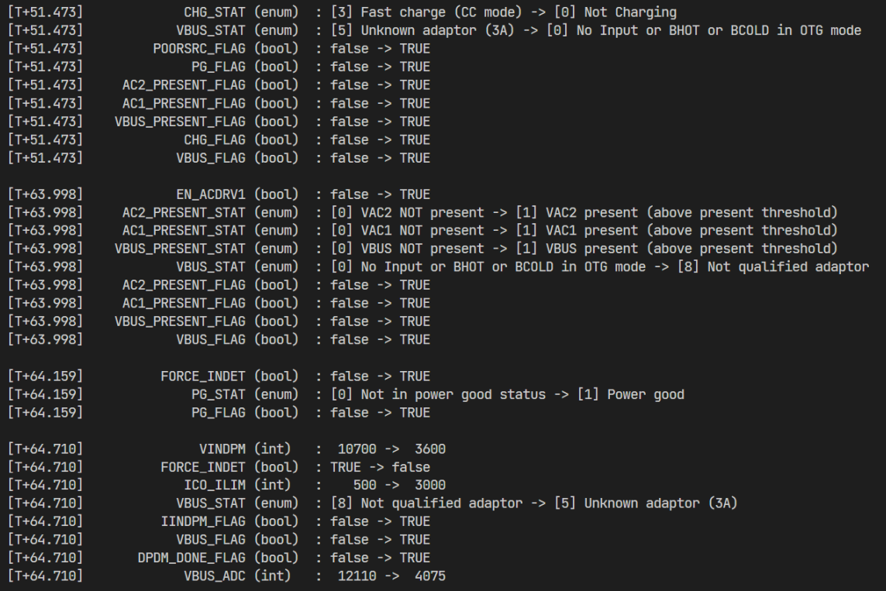

# BQ25798 library for Arduino

This library is designed to work with the BQ25798 battery charger IC from Texas Instruments.

## Features

What would you like to use?

This:

```
Bat_WriteSingleRegister(0x2E, bat_register.REG2E_ADC_Control | 0x80); //ADC enable bit:7			
Bat_WriteSingleRegister(0x18, bat_register.REG18_NTC_Control_1 | 0x01); //TS ignore
Bat_WriteSingleRegister(0x0F, bat_register.REG0F_Charger_Control_0 | 0x01);   //EN_BACKUP
```

or this:

```
BQ25798 bq = BQ25798();

bq.setAndWriteBool(bq.ADC_EN, 1);
bq.setAndWriteBool(bq.TS_IGNORE, 1);
bq.setAndWriteBool(bq.EN_BACKUP, 1);
```

?

This library offers a simple interface to read and write registers in the BQ25798. No bit manipulation is needed. No search for register addresses. No need to remember what different enum values mean. Just use the enum names and the library will take care of the rest.

Use the included "track_changes" example to see how the library works. It will read the registers and print them to the serial monitor like this:



Much better than `reg[0x2E] = 0x80`, don't you think?