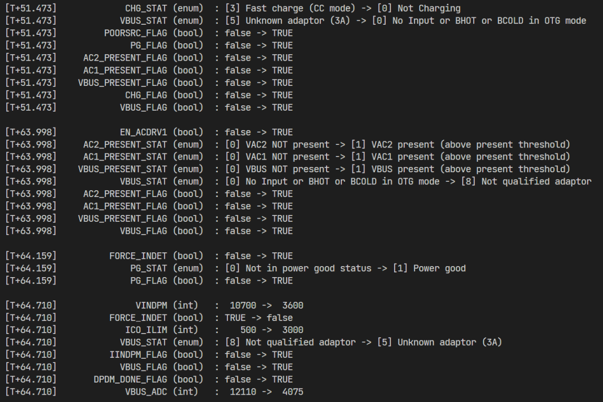

# BQ25798 library for Arduino

This library offers a simple interface to communicate with the BQ25798 battery charger IC from Texas Instruments. No bit manipulation is needed. No search for register addresses. No need to remember what different enum values mean. Just use the enum names and the library will take care of the rest.

## Features

Easy use with clearly named registers and bitfields.

```
BQ25798 bq = BQ25798();

bq.setAndWriteBool(bq.ADC_EN, true);
bq.setAndWriteBool(bq.TS_IGNORE, true);
bq.setAndWriteBool(bq.EN_BACKUP, true);

bq.setAndWriteEnum<BQ25798::adc_rate_t>(bq.ADC_RATE, BQ25798::adc_rate_t::ONESHOT);
```

## Example

Use the included "track_changes" example to see how the library works. It will read the registers and print them to the serial monitor like this:



## Testing

```bash
platformio test -e native
```
